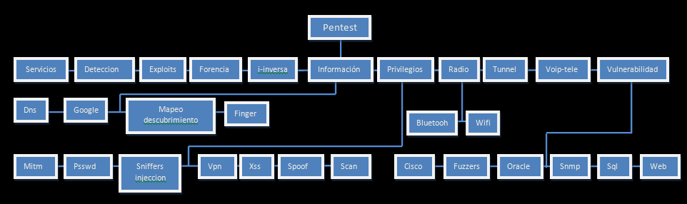

  

## What is DreamJ?

        ____                                __
       / __ \________  ____ _____ ___      / /
      / / / / ___/ _ \/ __ `/ __ `__ \__  / / 
     / /_/ / /  /  __/ /_/ / / / / / / /_/ /  
    /_____/_/   \___/\__,_/_/ /_/ /_/\____/
    By Jose Luis Blas Ralde

It is my first Linux project It was created on 2011 for learning purposes 
my goals are (by doing):

* Learn how to linux works
* how to build a distro
* how works pentesting tools
* how to compile/manage kernel linux and modules
* how to compile form source code
* how use package manager
* how to configure network
* how to use scripts
* how to use diferents hypervisors
* how much resources does linux use
* how to use this distro for pentesting purposes
* how to capture/inject network traffic in a computer using qemu and this distro without boot from usb and installing something 
* the difference between linux distros

SUMARY: Is a minimal pentesting distro based in [Damn Small Linux 4.4.10](http://www.damnsmalllinux.org/). I really learned a lot doing this distribution.

## What does it contains?
It contains 283 tools, and some most popular pentesting/hacking tools from 2011!!!

* Metasploit
* Nmap
* Umit
* Etthercap

and many more!!! this the /pentest directory

the complete list is [here](tools.htm)

and the welcome message is [here](ayuda.html) in spanish

## Does currently works?

Yes, but all tools are discontinued and all you need is 512mb of ram 
there are 2 versions [here on sourceforge](https://sourceforge.net/projects/d-project/files/dream-j/) for download 

* DreamJ-_v099.iso ISO version (956.3 MB)
* DreamJ-v0.99.7z for run under windows using qemu and qemu-pcap for capturing traffic (957.5 MB), and has and option for boot from usb, here an screenshot:

## Some screenshots

* main screen

* Netdiscover, Nmap, Metasploit and Tcpdump

* Pentbox, SET and Evilgrade

* Burp suite, OWASP Dirbuster, Grendel Scan, Metacoretext

* Zenmap, Etthercap, Wireshark

check the "screenshots" dir for more screenshots                               
